<h1 align="center">💼 HireTrack 💼</h1>

## Table of Contents
- [Project Overview](#project-overview)
- [Key Features](#key-features)
- [Screenshots](#screenshots)
- [Getting Started](#getting-started)
  - [Tech Stack](#tech-stack)
  - [Installation](#installation)
  - [Folder Structure](#folder-structure)
- [Usage](#usage)
- [Architecture & Database](#architecture--database)
- [Security & Privacy](#security--privacy)

## Project Overview

**HireTrack** is a sophisticated full-stack **Job Portal and Applicant Tracking System (ATS)** built using the MERN stack. It is designed to bridge the gap between recruiters and job seekers by providing deeply tailored, feature-rich dashboards for both roles. This system aims to enhance the efficiency of recruitment by providing seamless job discovery, real-time application tracking, interactive interview scheduling, and instant notifications.

## Key Features:
- **Authentication**: User registration and login with JWT-based authentication.
- **User Roles**: Job Seeker and Recruiter with role-based access.
- **Job Management**: Recruiters can create, update, publish, and close job postings.
- **Job Search**: Job seekers can search and filter jobs by title, location, experience, salary, and employment type.
- **Job Application**: Job seekers can apply for jobs by submitting their resume and required details.
- **Application Tracking**: Applicants can view their application status, such as Applied, Shortlisted, Interview, Selected, or Rejected.
- **Recruiter Dashboard**: Recruiters can view jobs, applicants, and application statistics.
- **Applicant Management**: Recruiters can review applicant profiles, resumes, and update application status.
- **Interview Management**: Recruiters can schedule interviews with applicants and store interview details.
- **Notifications**: Notify users when an application status is changed or an interview is scheduled.
- **Pagination & Filtering**: Implement server-side pagination, search, sorting, and filtering for jobs and applications.
- **Security**: Implement proper authorization, input validation, file validation, and secure API handling.
- **UI**: Build a responsive and user-friendly React interface for both job seekers and recruiters.

> **NOTE:** These features provide a complete end-to-end flow for modern recruitment processes, ensuring high performance and data security.

## Screenshots

Below are some screenshots showing the features and layout of the system:

### Authentication & Access
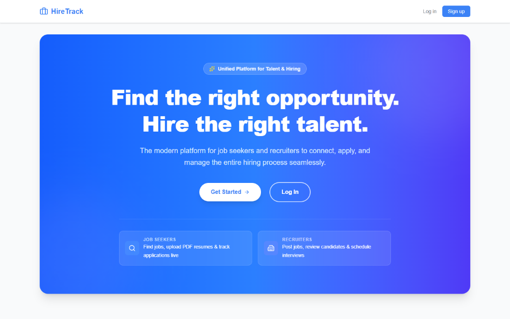&nbsp;&nbsp;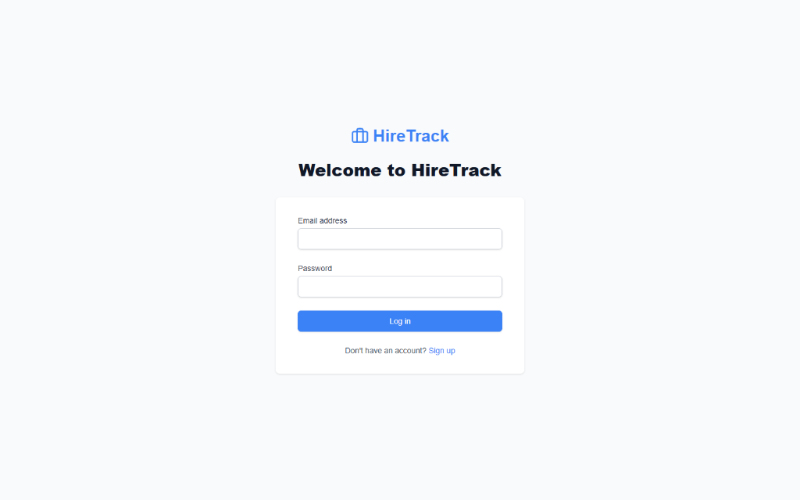&nbsp;&nbsp;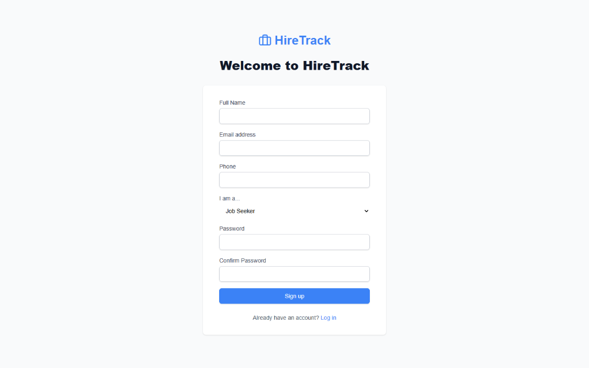&nbsp;&nbsp;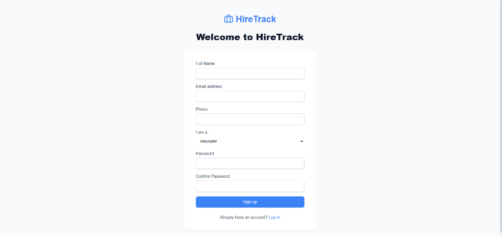

### Recruiter Experience
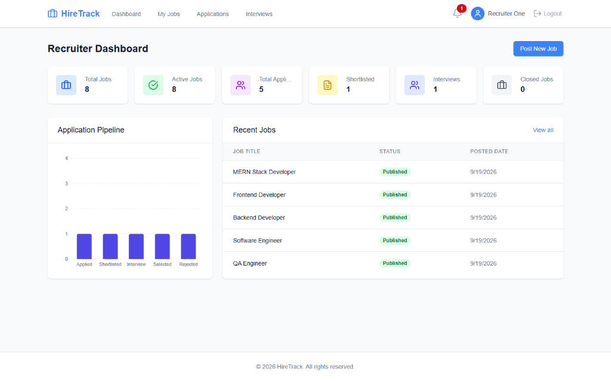&nbsp;&nbsp;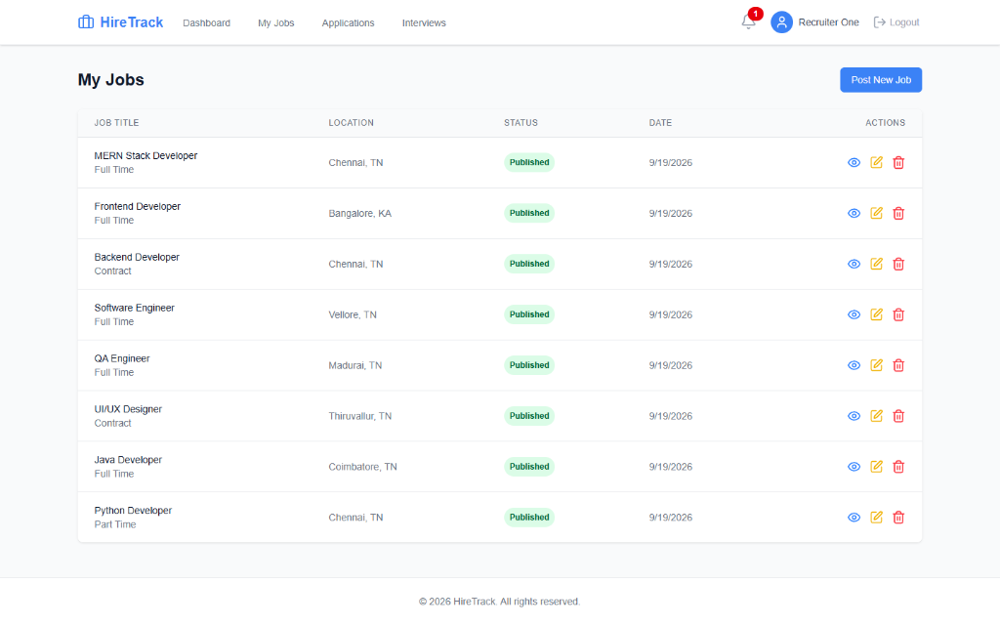&nbsp;&nbsp;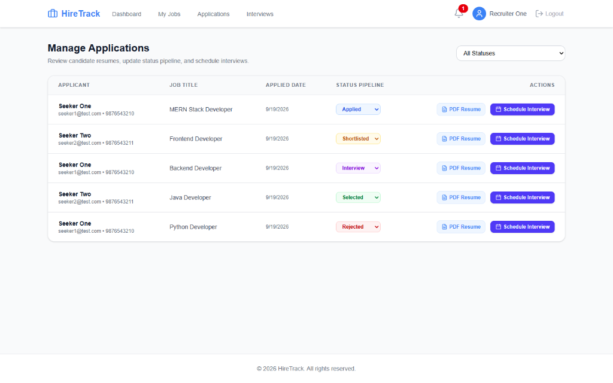&nbsp;&nbsp;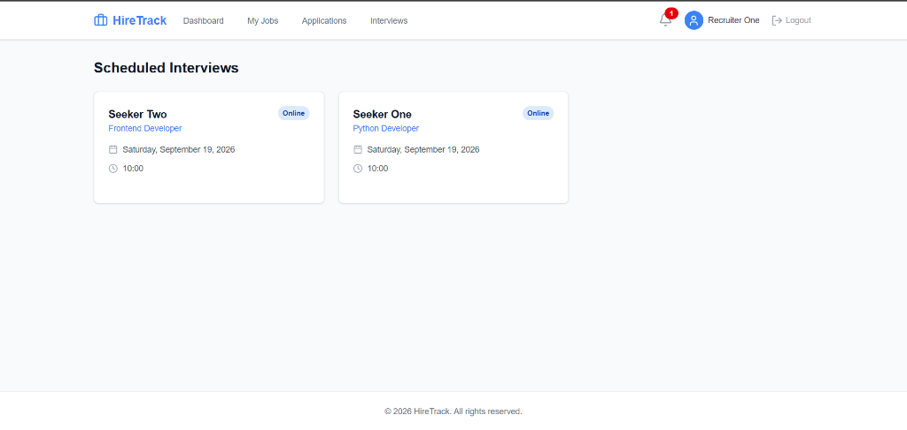
<br><br>
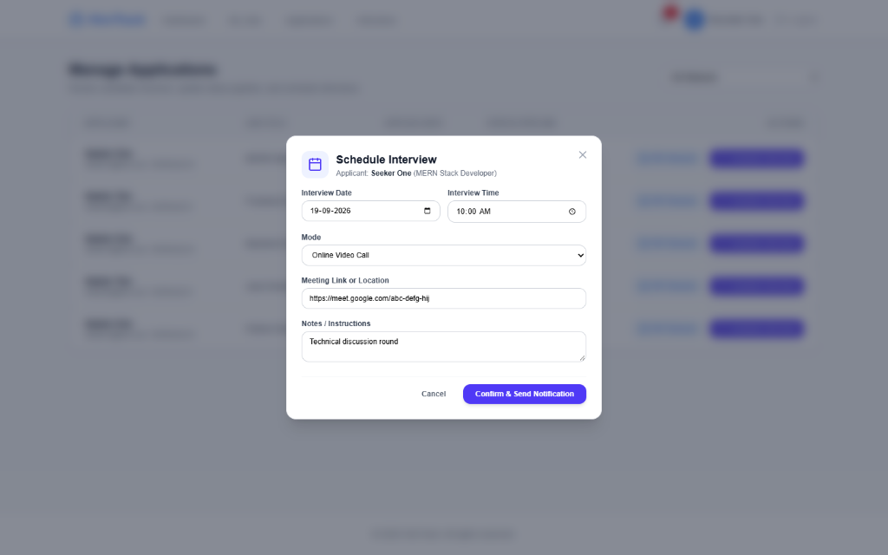&nbsp;&nbsp;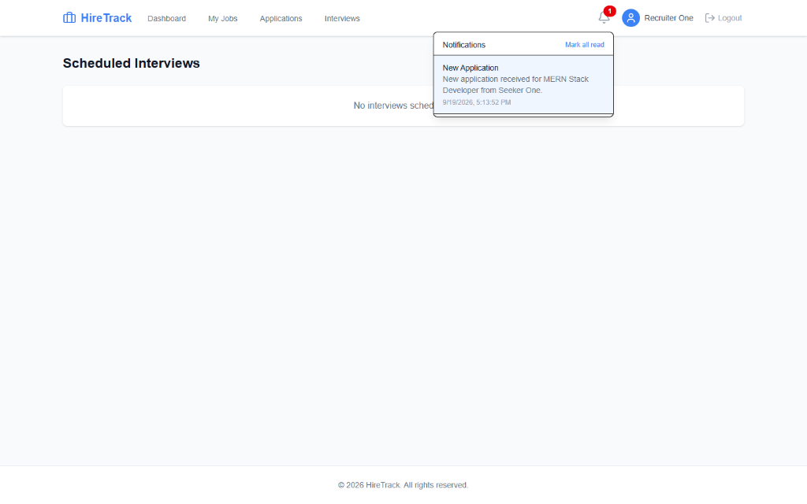&nbsp;&nbsp;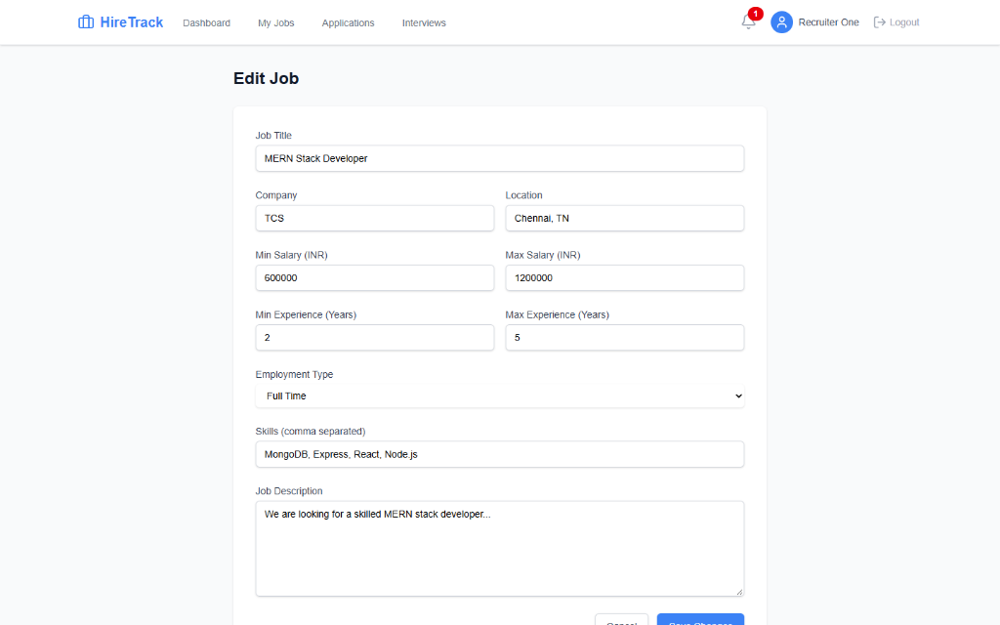

### Job Seeker Experience
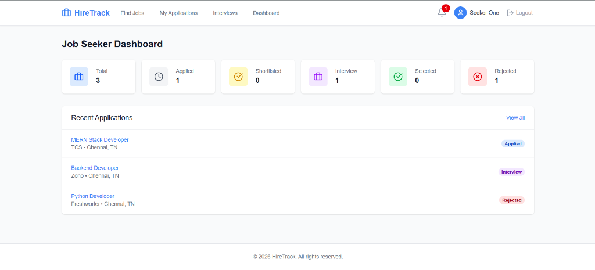&nbsp;&nbsp;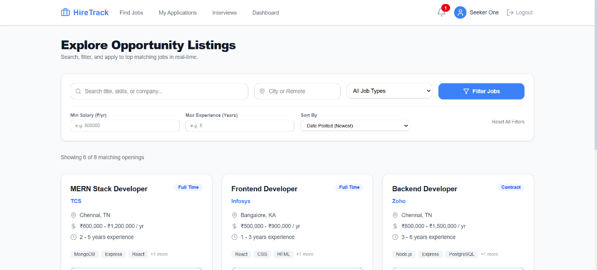&nbsp;&nbsp;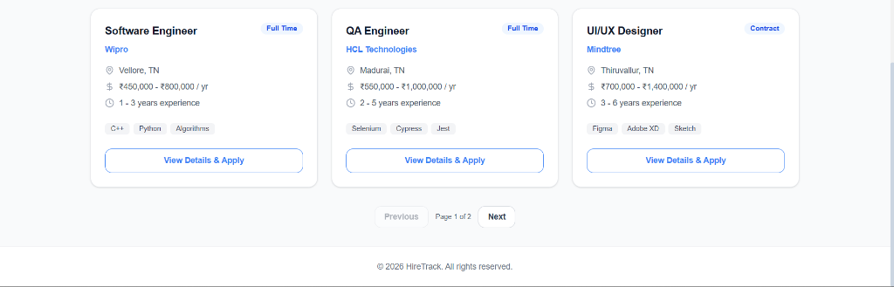&nbsp;&nbsp;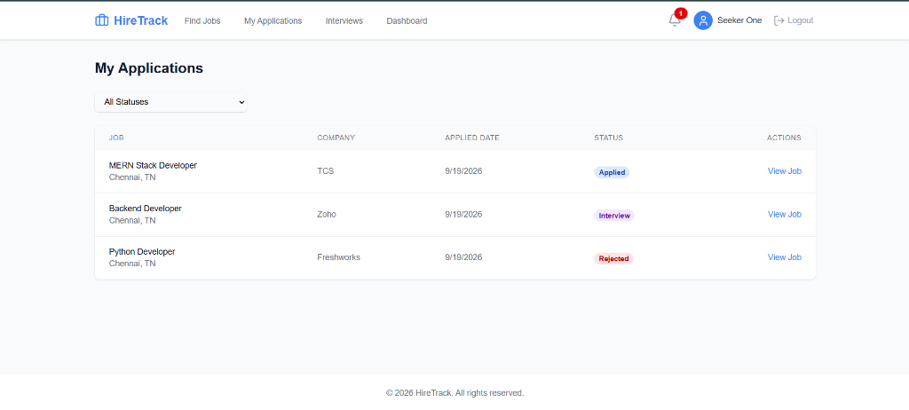
<br><br>
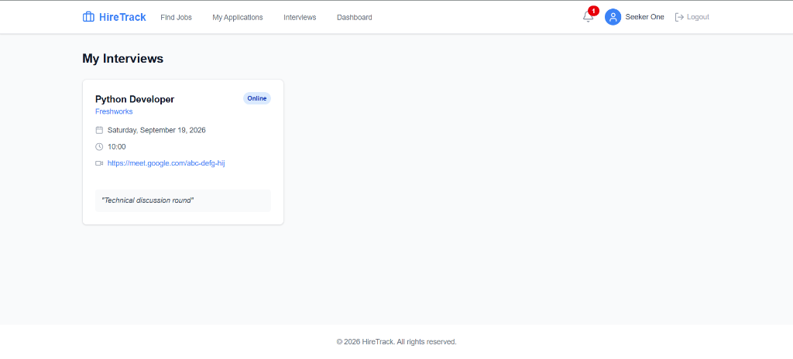

### Validation & Edge Cases
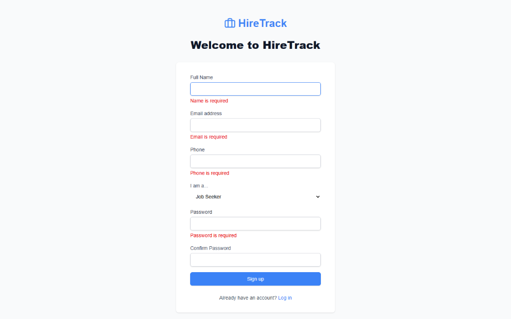&nbsp;&nbsp;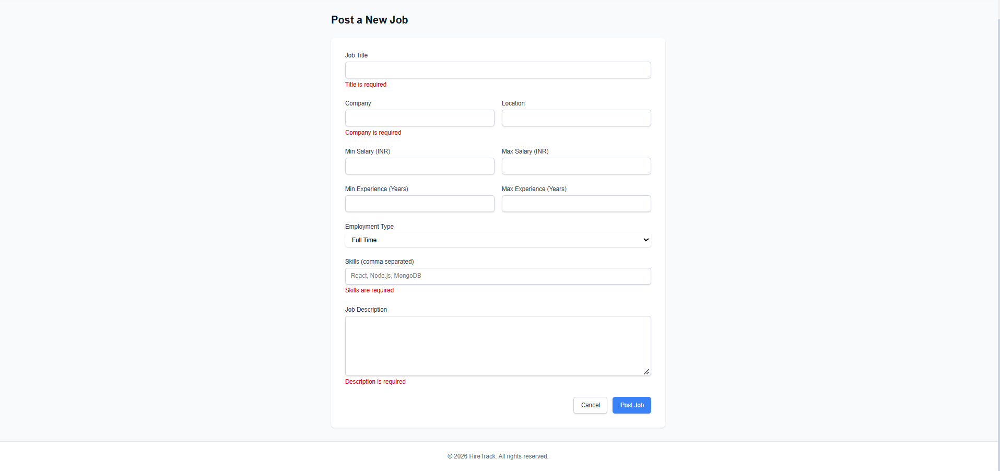

> **NOTE:** These screenshots reflect the comprehensive validation, dashboards, and modal designs present in the production-ready application.

## Getting Started

### Tech Stack:

- **Node.js & Express**: A powerful backend runtime and REST API framework.
- **React.js**: A high-performance library for building user interfaces.
- **MongoDB & Mongoose**: A NoSQL database and ODM for robust data modeling.
- **Tailwind CSS**: A utility-first CSS framework for quickly designing responsive, modern web interfaces.
- **JWT (JSON Web Tokens)**: Secure, stateless user authentication.
- **bcryptjs**: Cryptographic library for secure password hashing.
- **Recharts**: JavaScript library for creating interactive analytics charts on the dashboard.
- **React Hook Form**: Performant frontend form handling and validation.
- **Multer**: Middleware for secure resume and PDF file uploads.
- **Lucide React**: Clean, modern iconography across the application.

### Installation:

1. Clone the repository:
   ```bash
   git clone https://github.com/Vishnu-KumarKR/HireTrack-Job-Portal.git
   cd HireTrack-Job-Portal
   ```

2. Backend Setup:
   ```bash
   cd server
   npm install
   ```
   Create a `.env` file in the `/server` directory:
   ```env
   PORT=5000
   MONGO_URI=your_mongodb_connection_string
   JWT_SECRET=your_super_secret_jwt_key
   JWT_EXPIRE=30d
   CLIENT_URL=http://localhost:5173
   ```
   Start the backend server:
   ```bash
   npm run dev
   ```

3. Frontend Setup:
   Open a new terminal window:
   ```bash
   cd client
   npm install
   ```
   Create a `.env` file in the `/client` directory:
   ```env
   VITE_API_URL=http://localhost:5000/api
   ```
   Start the frontend development server:
   ```bash
   npm run dev
   ```

### Folder Structure:
```bash
.
├── client/                 # React frontend application
│   ├── src/
│   │   ├── components/     # Reusable UI components
│   │   ├── pages/          # Page components (Auth, Seeker, Recruiter)
│   │   │   ├── auth/       # Login and Registration pages
│   │   │   ├── seeker/     # Job Seeker dashboards and views
│   │   │   └── recruiter/  # Recruiter management interfaces
│   │   ├── layouts/        # Application layouts and wrappers
│   │   ├── context/        # React Context (Auth state)
│   │   ├── hooks/          # Custom React hooks
│   │   ├── services/       # API integration and Axios setup
│   │   ├── utils/          # Helper functions
│   │   └── App.jsx         # Main React application component
│   │   .
│   │   .
│   └── package.json        # Frontend dependencies
│
├── server/                 # Node.js/Express backend API
│   ├── config/             # Database connection and config
│   ├── controllers/        # Request handlers and business logic
│   ├── middleware/         # Auth, error, and upload middlewares
│   ├── models/             # Mongoose database schemas
│   ├── routes/             # API route definitions
│   ├── services/           # Reusable backend services
│   ├── utils/              # Backend helper functions
│   ├── seed/               # Database seeder scripts
│   ├── uploads/            # Temporary storage for uploaded resumes
│   ├── server.js           # Backend entry point
│   └── package.json        # Backend dependencies
│   .
│   .
├── Images/                 # Documentation and README assets
├── .gitignore              # Git ignored files
└── README.md               # Project documentation
```

## Usage

- Open the application in your browser (`http://localhost:5173`).
- Create an account as a Job Seeker to browse and apply for jobs.
- Create an account as a Recruiter to post jobs, manage applications, and schedule interviews.
- Use the Dashboard to visualize real-time analytics and track pipeline statuses.

## Architecture & Database

HireTrack follows a strict modular MVC backend architecture ensuring decoupled code. Data is stored in highly relational MongoDB structures referencing `ObjectIds` to ensure normalization.

### Main Collections
```bash
User
 │
 ├── Job
 │     │
 │     └── Application
 │              │
 │              └── Interview
 │
 └── Notification
```

## Security & Privacy

HireTrack implements robust security measures at every layer:
* **Stateless JWT Authentication:** Verified securely via HTTP Headers.
* **Password Cryptography:** Hashes via `bcryptjs`.
* **Resource Authorization:** Backend strictly validates `ObjectId` ownership to prevent cross-account modifications.
* **Anti-Inspection:** Global event listeners optionally disable right-click and dev-tools to protect IP in production.
* **File Upload Security:** Restricts uploads strictly to `.pdf` formats and enforces maximum file sizes securely via Multer.
