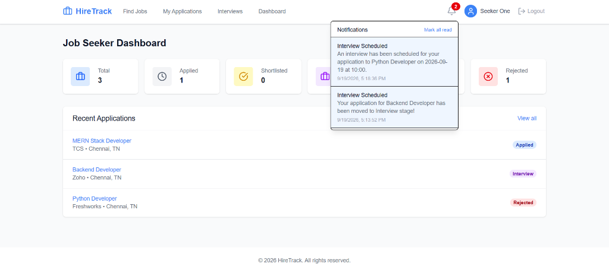

# HireTrack — Premium Job Portal & ATS

<div align="center">


### A full-stack MERN Job Portal and Applicant Tracking System for modern recruiters and job seekers.

[Features](#-features) • [Application Flow](#-application-flow) • [Tech Stack](#%EF%B8%8F-technology-stack) • [Architecture](#%EF%B8%8F-architecture) • [Setup](#%E2%9A%99%EF%B8%8F-installation--setup) • [Security](#-security) • [API](#-api-overview)

</div>

---

## 📌 Project Overview

**HireTrack** is a production-ready, full-stack **Job Portal and Applicant Tracking System (ATS)** built using the **MERN stack — MongoDB, Express.js, React.js, and Node.js**.

The platform provides deeply tailored experiences for both **Job Seekers** and **Recruiters**.

- **Job Seekers** can discover jobs using advanced filtering, apply instantly with their resumes, track application progress in real-time, view scheduled interviews, and receive immediate in-app notifications.
- **Recruiters** can seamlessly create and manage job postings, review rich applicant profiles, manage candidate pipeline statuses, schedule interviews via dynamic modals, and monitor entire recruitment statistics through a dedicated dashboard.

The project is highly focused on:
* **Authentication:** User registration and login with JWT-based authentication.
* **User Roles:** Job Seeker and Recruiter with role-based access.
* **Job Management:** Recruiters can create, update, publish, and close job postings.
* **Job Search:** Job seekers can search and filter jobs by title, location, experience, salary, and employment type.
* **Job Application:** Job seekers can apply for jobs by submitting their resume and required details.
* **Application Tracking:** Applicants can view their application status, such as Applied, Shortlisted, Interview, Selected, or Rejected.
* **Recruiter Dashboard:** Recruiters can view jobs, applicants, and application statistics.
* **Applicant Management:** Recruiters can review applicant profiles, resumes, and update application status.
* **Interview Management:** Recruiters can schedule interviews with applicants and store interview details.
* **Notifications:** Notify users when an application status is changed or an interview is scheduled.
* **Pagination & Filtering:** Implement server-side pagination, search, sorting, and filtering for jobs and applications.
* **Security:** Implement proper authorization, input validation, file validation, and secure API handling.
* **UI:** Build a responsive and user-friendly React interface for both job seekers and recruiters.

---

# 🚀 Application Showcase & Features

| Core Module & Interface | Visual Preview | Technical Features & Capabilities |
| :--- | :--- | :--- |
| **Authentication & RBAC**<br>Secure login, registration, and role routing |  <br>  | • **Stateless JWT:** Bulletproof authentication mechanism.<br>• **Role-Based Access Control (RBAC):** Instantly routes users to Recruiter or Seeker views.<br>• **Security:** Bcrypt password hashing and protected API routes. |
| **Recruiter Dashboard**<br>Comprehensive analytics pipeline |  | • **Data Visualization:** Built with Recharts to beautifully display pipeline metrics.<br>• **Pipeline Metrics:** Displays Total Jobs, Published Jobs, and visualizes candidate distribution across Applied, Interview, and Selected stages. |
| **Job Management**<br>Create, edit, and publish job postings |  | • **Seamless Control:** Recruiters can effortlessly Create, Edit, Publish, Close, and Delete jobs.<br>• **Authorization:** Strict backend data-ownership checks ensure recruiters only modify their own postings. |
| **Application Tracking**<br>Review applicants and track statuses |   | • **Rich Profiles:** Review comprehensive application details and instantly view uploaded PDF resumes.<br>• **Dynamic Pipeline:** Update application statuses (Shortlisted, Interview, Selected) from dynamic dropdowns.<br>• **Interview Tracking:** Track all upcoming scheduled interviews in one place. |
| **Interview Scheduling**<br>Dynamic modal scheduling integration |  | • **Premium Modals:** Easily set the Interview Date, Time, Mode (Online/In-person), and Meeting Link.<br>• **Automated Pipeline:** Once scheduled, the application instantly moves to the Interview stage, triggering live notifications. |
| **Job Discovery & Filtering**<br>Lightning-fast search and pagination |  | • **Deep Filtering:** Filter by Title, Location, Salary, Experience, and Employment Type.<br>• **Server-Side Operations:** Implements robust server-side search and pagination for massive scalability.<br>• **UX:** Modern skeleton loaders ensure a premium feel while fetching data. |
| **Seeker Dashboards**<br>Personalized candidate portal | <br> <br> | • **Integrated Apply:** Clicking "Apply Now" scrolls dynamically to an integrated application form for PDF resume upload.<br>• **Real-Time Tracking:** Seekers track all applications and upcoming interviews in real-time without ever emailing a recruiter. |
| **Real-Time Notifications**<br>Live alerts and polling |   | • **Live Polling:** Notifications poll silently and display a red unread badge when triggered.<br>• **Instant Alerts:** Seekers are notified on status changes; Recruiters are alerted upon new inbound applications. |
| **Validation & Edge Cases**<br>Strict input sanitization & errors |  <br> | • **Client-Side:** Powered by `react-hook-form`, forms check PDF sizes, emails, and passwords before hitting the server.<br>• **Server-Side:** Redundant strict schema validations via Mongoose.<br>• **Dynamic Data:** Complex modals dynamically pre-populate existing data instantly. |

---

# 🏗️ Architecture

HireTrack follows a strict, modular full-stack architecture ensuring decoupled and scalable code.

```text
                    React Frontend
                         │
                         │ Axios / REST API
                         ▼
                  Express.js API
                         │
              ┌──────────┴──────────┐
              │                     │
        Authentication         Controllers
              │                     │
              └──────────┬──────────┘
                         ▼
                    Services
                         │
                         ▼
                     Mongoose
                         │
                         ▼
                     MongoDB
```

---

# 🛠️ Technology Stack

## Frontend (Client)
| Technology | Purpose |
| :--- | :--- |
| **React.js** | User Interface |
| **Vite** | Blazing-fast build tool |
| **Tailwind CSS** | Premium, responsive styling |
| **React Hook Form** | Performant form handling |
| **React Router** | Protected client-side routing |
| **Recharts** | Interactive dashboard charts |
| **Lucide React** | Clean, modern iconography |

## Backend (Server)
| Technology | Purpose |
| :--- | :--- |
| **Node.js & Express** | REST API framework |
| **MongoDB & Mongoose**| Database & ODM |
| **JWT & bcryptjs** | Stateless auth & password hashing |
| **Multer** | Secure resume/PDF file uploads |
| **Helmet & CORS** | Security headers & cross-origin config |

---

# 🗂️ Project Structure

```text
HireTrack-Job-Portal/
│
├── client/                 # React frontend application
│   ├── src/
│   │   ├── components/     # Reusable UI components
│   │   ├── pages/          # Page components (Auth, Seeker, Recruiter)
│   │   │   ├── auth/       # Login and Registration pages
│   │   │   ├── seeker/     # Job Seeker dashboards and views
│   │   │   └── recruiter/  # Recruiter management interfaces
│   │   ├── layouts/        # Application layouts and wrappers
│   │   ├── context/        # React Context (Auth state)
│   │   ├── hooks/          # Custom React hooks
│   │   ├── services/       # API integration and Axios setup
│   │   ├── utils/          # Helper functions
│   │   └── App.jsx         # Main React application component
│   │
│   └── package.json        # Frontend dependencies
│
├── server/                 # Node.js/Express backend API
│   ├── config/             # Database connection and config
│   ├── controllers/        # Request handlers and business logic
│   ├── middleware/         # Auth, error, and upload middlewares
│   ├── models/             # Mongoose database schemas
│   ├── routes/             # API route definitions
│   ├── services/           # Reusable backend services
│   ├── utils/              # Backend helper functions
│   ├── seed/               # Database seeder scripts
│   ├── uploads/            # Temporary storage for uploaded resumes
│   ├── server.js           # Backend entry point
│   └── package.json        # Backend dependencies
│
├── Images/                 # Documentation and README assets
├── .gitignore              # Git ignored files
└── README.md               # Project documentation
```

---

# 🗄️ Database Structure

Highly relational document structures referencing ObjectIds ensuring database normalization.

### Main Collections
```text
User
 │
 ├── Job
 │     │
 │     └── Application
 │              │
 │              └── Interview
 │
 └── Notification
```

---

# 🔐 Security & Privacy

HireTrack implements robust security measures at every layer:

* **Stateless JWT Authentication:** Verified via HTTP Headers.
* **Password Cryptography:** Hashes via `bcryptjs`.
* **Resource Authorization:** Backend strictly validates `ObjectId` ownership to prevent cross-account modifications.
* **Anti-Inspection:** Global event listeners optionally disable right-click and dev-tools to protect IP in production.
* **File Upload Security:** Restricts uploads strictly to `.pdf` formats and enforces maximum file sizes securely via Multer.

---

# ⚙️ Installation & Setup

### Prerequisites
* Node.js (v16+)
* MongoDB (Local or Atlas URL)

### 1. Clone the repository
```bash
git clone https://github.com/Vishnu-KumarKR/HireTrack-Job-Portal.git
cd HireTrack-Job-Portal
```

### 2. Backend Setup
```bash
cd server
npm install
```
Create a `.env` file in the `/server` directory:
```env
PORT=5000
MONGO_URI=your_mongodb_connection_string
JWT_SECRET=your_super_secret_jwt_key
JWT_EXPIRE=30d
CLIENT_URL=http://localhost:5173
```
Start the backend server:
```bash
npm run dev
```

### 3. Frontend Setup
Open a new terminal window:
```bash
cd client
npm install
```
Create a `.env` file in the `/client` directory:
```env
VITE_API_URL=http://localhost:5000/api
```
Start the frontend development server:
```bash
npm run dev
```

### 4. Seed Dummy Data (Optional)
To populate the database with extremely rich sample jobs, applicants, and pipeline data for immediate demonstration:
```bash
cd server
node seed/seeder.js --clean
```

---

# 👨‍💻 Developer

**Vishnu Kumar K R**  
B.E. Computer Science & Engineering  
GitHub: [Vishnu-KumarKR](https://github.com/Vishnu-KumarKR)

---

<div align="center">
  <h3>HireTrack</h3>
  <p><em>Connecting talent with opportunities through a modern, seamless recruitment workflow.</em></p>
</div>
